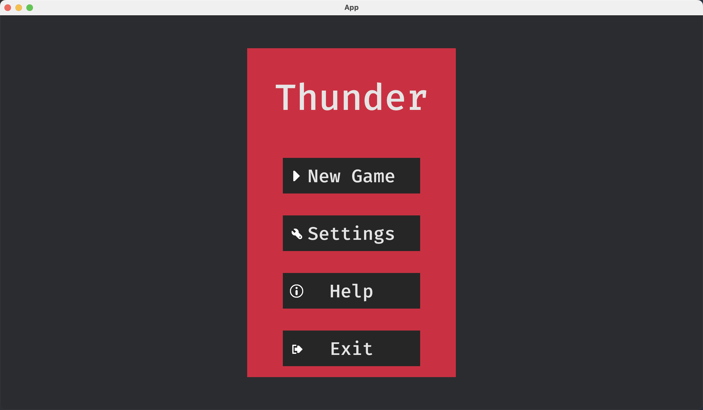
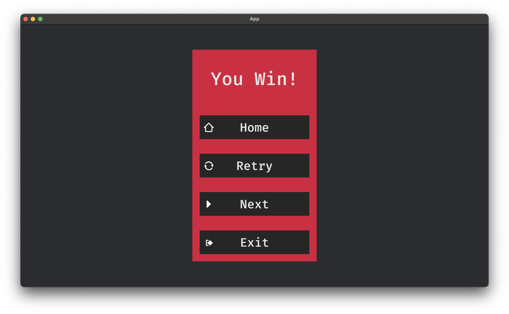

# 《Rust程序设计》课程实践报告

（个人信息）

小组成员：徐陈皓，吴悦天，方嘉聪，孙嘉伟，胡宇阳

**说明：本报告主要介绍我们的项目`Thunder`的设计和开发过程，因此由所有小组成员合作撰写，每个小组成员都参与了项目的设计和开发，我们每个人上交的报告内容除了照片以外是基本一致的。**

## 我们完成的项目`Thunder`

**GitHub仓库地址：[Thunder-in-Rust](https://github.com/bucket-xv/Thunder-in-Rust)**

**Web版本游戏地址（加载较慢，请耐心等候）：[Thunder](https://bucket-xv.github.io/Thunder-in-Rust/)**

### 概览

我们用`Rust`重制了雷电战机这个经典游戏，历时约三个月，共4000+行`Rust`代码。它基于`Bevy`游戏引擎开发，支持`Web`和`本地开发`两种版本。概要地说，我们为这个项目做了以下工作：

- 我们阅读了`Bevy`游戏引擎的相关文档，学习了其中基本的接口使用方法和`ECS`(Entity, Compenent, System)游戏开发逻辑。
- 我们完成了游戏的主体设计和开发，包括游戏的基本逻辑、图形界面、音效等。
- 我们利用`Bevy`引擎的支持，将游戏部署到了`GitHub Pages`上，使得用户可以直接通过浏览器访问游戏。

### 背景：`Bevy`游戏引擎

（胡宇阳）

### 代码设计

概要地说，我们的游戏有以下几个界面：

- 主菜单
- 关卡选择界面
- 游戏界面
- 暂停界面
- 结算界面

接下来的报告将围绕这些界面中的关键代码展开。

#### 主菜单

Thunder的菜单逻辑以一个 Bevy Plugin 的形式实现，这个 plugin 向 App 中添加了若干system，用来控制进入特定状态时各菜单的渲染、点击按钮时的交互以及状态转移前屏幕元素的清除，主要代码如下：

```rust
pub fn menu_plugin(app: &mut App) {
    app
        // At start, the menu is not enabled. This will be changed in `menu_setup` when
        // entering the `GameState::Menu` state.
        // Current screen in the menu is handled by an independent state from `GameState`
        .init_state::<MenuState>()
        .add_systems(OnEnter(GameState::Menu), menu_setup)
        // Systems to handle the main menu screen
        .add_systems(OnEnter(MenuState::Main), main_menu_setup)
        .add_systems(OnExit(MenuState::Main), despawn_screen::<OnMainMenuScreen>)
        // Systems to handle the level picking menu screen
        .add_systems(OnEnter(MenuState::Levels), level_select_menu_setup)
        .add_systems(Update, (level_button.run_if(in_state(MenuState::Levels)),))
        .add_systems(
            OnExit(MenuState::Levels),
            despawn_screen::<OnLevelsMenuScreen>,
        );
    //omitted
}
```

具体来说，菜单是一个 State Machine, `menu.rs` 中定义了一个 `MenuState`: 


```rust 
pub enum MenuState {
    Main,
    Levels,
    Settings,
    SettingsDisplay,
    SettingsSound,
    Help,
    #[default]
    Disabled,
}
```

从这个 enum 的定义可以清晰地看出菜单的几个状态，即主菜单，关卡选择，设置，设置显示，设置声音，帮助和禁用状态。
主菜单样式如图：



System `main_menu_setup` 会在 `Menustate` 变为 `Main` 状态时运行，利用 `commands.spawn` 和一个 `asset_server` (用来加载图标等多媒体素材)，在屏幕中央渲染出菜单界面以及其中的各个按钮。菜单界面的层次结构是利用 spawn bundle 时的 parent-children 特性实现，在 spawn 一个 bundle 后，可以用 `.with_children(|parent| {...})` 传入一个closure，closure中可以继续用`parent.spawn` 生成子元素。例如上图中，最底层的背景板是一个 `NodeBundle`, 它的儿子是另一个`NodeBundle`即中间的红框，红框有五个儿子，分别是一个 `TextBundle` "Thunder" 和四个 `ButtonBundle`, 而四个 `ButtonBundle` 分别各有一个儿子 `TextBundle` 用来写对应的图标和文字。这种树形结构使得菜单的组织非常清晰。

Button 被点击之后的跳转也是通过若干个 system 实现，他们监听按钮交互事件并对`MenuState` 和 `GameState` 作出相应的修改，从而使游戏在 State Machine 上移动。例如 `menu_action` 是对主菜单各按钮点击交互的处理：

```rust
pub fn menu_action(...) {
    //omitted
    match menu_button_action {
        MenuButtonAction::Quit => {
            app_exit_events.send(AppExit);
        }
        MenuButtonAction::SelectLevel => {
            menu_state.set(MenuState::Levels);
        }
        MenuButtonAction::Settings => menu_state.set(MenuState::Settings),
        MenuButtonAction::SettingsDisplay => {
            menu_state.set(MenuState::SettingsDisplay);
        }
        //ommitted
    }
}
```

#### 关卡选择

在主菜单中点击 New Game 会进入关卡选择界面。


关卡的实现机制是定义了一个全局的 resource：

```rust
// Levels to play that can be choose in the menu. It will be a resource in the app
#[derive(Resource, Debug, Component, PartialEq, Eq, Clone, Copy)]
struct Level(u32);
```

在菜单中用上文介绍的方法和思路渲染出 level select menu，并设计一个 level button 的交互系统。与设置部分等按钮交互系统不同的是，level按钮在选择之后，应该既像其他设置一样更新对应的resource，但又不能仍然停留在 menu 界面，而是应该进入游戏。具体实现中，我们还加入了一个 level splash screen（`level_splash.rs`） ，用于在进入游戏之前显示当前关卡，level splash screen 结束之后进入游戏。在生成敌人以及配置武器时，会根据 level 这个 resource 的值来进行不同的配置，从而实现关卡机制。

#### 结算

结算界面设计为`game`下的一个子module`win_lose_screen`，在其中实现了胜利界面、失败界面和通关界面，同样使用Bevy Plugin的形式实现，三个界面的实现逻辑类似，下面以胜利界面为例：

```rust
pub fn win_lose_screen_plugin(app: &mut App) {
    app.init_state::<WinLoseScreenState>()
        .add_systems(OnEnter(GameState::Win), win_screen_setup)
        .add_systems(
            OnEnter(WinLoseScreenState::BackToMainMenu),
            back_to_main_menu,
        )
        .add_systems(OnEnter(WinLoseScreenState::Restart), restart_level)
        .add_systems(OnEnter(WinLoseScreenState::NextLevel), next_level)
        .add_systems(
            Update,
            (win_lose_screen_action, button_system).run_if(in_state(GameState::Win)),
        )
        .add_systems(OnExit(GameState::Win), despawn_screen::<OnWinScreen>)
    //omitted
}
```

胜利界面的`enum`如下，每个可能分别对应了下图中的一个按钮：

```rust
enum WinLoseScreenState {
    BackToMainMenu,
    Restart,
    NextLevel,
    #[default]
    Disabled,
}
```



通过监控游戏中的Player血量以及剩余的敌人数量来判定游戏的输赢(`GameState::Win`)，`Retry`按钮进入`WinLoseScreenState::Restart`，`NextLevel`会进入`WinLoseScreenState::NextLevel`，进而调用system`next_level`更新关卡参数`level_setting`进入下一关(最后一关进行特判确定是否通过所有关卡`GameState::Completion`)。

#### 暂停

Thunder的的暂停菜单设计为`game`下的一个子module`esc_menu`，以一个Bevy Plugin的形式实现，和主菜单逻辑类似，通过进出状态(State-System)控制各菜单的渲染、点击按钮时的交互以及状态转移前屏幕元素的清除。因为与结算界面相似，这里不再展示代码。

更具体地，我们将暂停菜单的状态定义为一个`enum`：

```rust
enum EscMenuState {
    MainEscMenu, // The main menu screen
    BackToGame,  // The screen that appears when the player clicks the "Back to Game" button
    BackToMainMenu,
    Help,
    #[default]
    Disabled,
}
```

通过在游戏主界面`game`实现一个Menu按钮，点按该按钮会进入暂停菜单(切换到`GameState::Stopped`状态)。同时为了方便用户操作，我们通过监听键盘事件，当用户按下`Esc`键时，也会进入暂停菜单。 

在暂停菜单中，我们提供了四个选项：返回游戏`Continue`，返回主菜单`Home`，帮助`Help`和退出游戏`Exit`。具体界面如下：


和主界面逻辑类似，在进入`GameState::Stopped`后会调用`esc_menu_setup`将`EscMenuState`设置成`MainEscMenu`，进而调用`esc_main_menu_setup`。使用`commands.spawn` 和`asset_server` (用来加载图标等多媒体素材)，在屏幕中央渲染出菜单界面以及其中的各个按钮。层次结构是利用 `spawn bundle` 时的 `parent-children` 特性实现。详细代码较为复杂，不在报告中展示。

Button 被点击之后的跳转也是通过若干个 system 实现，监听按钮交互事件并对`EscMenuState` 和 `EscGameState`和`GameState` 作出相应的修改，由此相应的游戏跳转逻辑，代码见下:

```rust
match esc_menu_button_action {
    EscMenuButtonAction::Quit => {
        app_exit_events.send(AppExit);
    }
    EscMenuButtonAction::BackToMainMenu => {
        esc_menu_state.set(EscMenuState::BackToMainMenu);
    }
    EscMenuButtonAction::BackToGame => {
        esc_menu_state.set(EscMenuState::BackToGame);
    }
    EscMenuButtonAction::GoToHelp => {
        esc_menu_state.set(EscMenuState::Help);
    }
    EscMenuButtonAction::BackToEscMenu => {
        esc_menu_state.set(EscMenuState::MainEscMenu);
    }
}
```

#### 游戏逻辑

游戏界面：


Thunder 的游戏逻辑在 `game` 模块中实现，这也是最核心的一个模块。`game.rs` 实现了一个插件 `game_plugin`，其核心代码如下：

```rust
// This plugin will contain the game. It will focus on the state `GameState::Game`
pub fn game_plugin(app: &mut App) {
    // omit some details
    app.add_systems(
        FixedUpdate,
        (
            generate_enemy,
            shoot_gun,
            apply_velocity,
            clear_laser,
            move_player_plane,
            shoot_laser,
            check_for_bullet_hitting,
            check_for_laserray_hitting,
            check_for_laser_star_capture,
            play_hitting_sound,
            update_scoreboard,
            update_hpboard,
            update_laserboard,
            check_for_next_wave,
            add_laser_star,
            remove_laser_star,
        )
            // `chain`ing systems together runs them in order
            .chain()
            .run_if(in_state(GameState::Game)),
    )
}
```

从中可以看出，在每一帧刷新时，`game_plugin`将会依次执行`generate_enemy,shoot_gun,apply_velocity,clear_laser,move_player_plane...`等一系列函数。也就是说，该`plugin`在每帧刷新时将会：

1. 生成敌人（`generate_enemy`）。敌人的具体配置由`game/config.rs`决定，不同的关卡和不同波次会有很大的区别。
2. 武器发射子弹（`shoot_gun,shoot_laser`）。一种武器是加特林机枪，它会向前打出连续的子弹。另一种武器是激光，他会打出镭射。和子弹不同的是，激光镭射是触发时立刻打出一个矩形向上方射出，该矩形延伸至上方边界，并会对矩形内部所有敌机产生伤害。
3. 处理移动（`move_player_plane,apply_velocity`）。无论是敌机还是玩家飞机，都需要根据速度和方向进行移动。敌机的速度由配置给出，而玩家的速度由键盘输入决定。
4. 碰撞检测（` check_for_bullet_hitting,check_for_laserray_hitting,check_for_laser_star_capture,`）。检测子弹和飞机的碰撞，激光和飞机的碰撞，以及星星和玩家飞机的碰撞。如果发生碰撞，调用相应的处理函数。
5. 更新计分板（`update_scoreboard,update_hpboard,update_laserboard,`）。根据击杀敌机的数量和玩家飞机剩下的血量更新左上角的计分板。
6. 其他功能函数，例如检测是否进入下一波敌机（`check_for_next_wave`），清除上一帧的激光（`clear_laser`）等。

### 网页端的开发与部署

`Rust`支持`WebAssembly`技术，即可以直接将`Rust`代码编译为`WebAssembly`代码。再利用`wasm-bindgen`工具，我们可以生成配套的`JavaScript`代码，套上`html`与`css`即可在主流浏览器中运行。我们将这套流程固化到`Makefile`中，只需要运行`make win-web/linux-web`即可生成`Web`版本的游戏。

```bash
linux-web:
	cargo build --release --target wasm32-unknown-unknown
	wasm-bindgen --no-typescript --target web --out-dir\
    ./docs/ --out-name "thunder"\
    ./target/wasm32-unknown-unknown/release/thunder.wasm
	cp -r assets docs
```

游戏的网页端使用`GitHub Pages`部署，我们在`GitHub`仓库的`Settings`中找到`GitHub Pages`选项，将`Source`设置为`master`分支中的`docs`文件夹，这样就可以通过`https://bucket-xv.github.io/Thunder-in-Rust/`访问我们的游戏。

### 项目开发过程

本项目从3月31日建立github仓库开始到开发结束历时约三个月，我们的开发过程主要分为以下几个阶段：

1. 框架搭建：我们首先学习了`Bevy`游戏引擎的基本使用方法与`ECS`的游戏开发逻辑。然后搭建了只包含主菜单和游戏界面的基本框架。
2. 游戏设计与主要功能开发：在此框架上，小组成员进行了分工开发，分别完成了关卡选择界面、暂停界面、结算界面、游戏机制等的开发。
3. 数值调整与动画：最后阶段，为了增加游戏的可玩性与吸引力，我们对游戏中的数值进行了精心调整，也对每一关分别做了设计。此外，我们还对游戏中的飞机做了动画。

分阶段开发是必要的，因为开发框架时，需要比较明确的规划设计。对业余的小型工程而言，最好由单人或双人开发，以保证规划的前后一致性。而到了主要功能开发的时候，任务相对独立，可以并行进行以提高开发效率。数值调整和动画是收尾工作，无法在游戏功能齐备之前进行，但也是游戏可玩性与吸引力的最重要保证。

### 项目展望

- 我们在github仓库上已经写了`README.md`并提供`MIT License`以开源项目。之后我们计划将注释补充完整并生成`doc`文件发布到网上以供潜在的合作者查阅。如有可能，可以打包该`crate`发布到`crate.io`上。
- 我们的游戏目前没有局外系统，也就是无法记录玩家已经通过的关卡与最高分数。这主要是为了`Web`版与本地版本的通用性而暂且搁置这一功能。之后我们计划在网页端通过`cookie`的方式保存玩家的游戏记录，在本地端则用文件方式保存。

## 个人照片

（照片）
（学期感言？）
